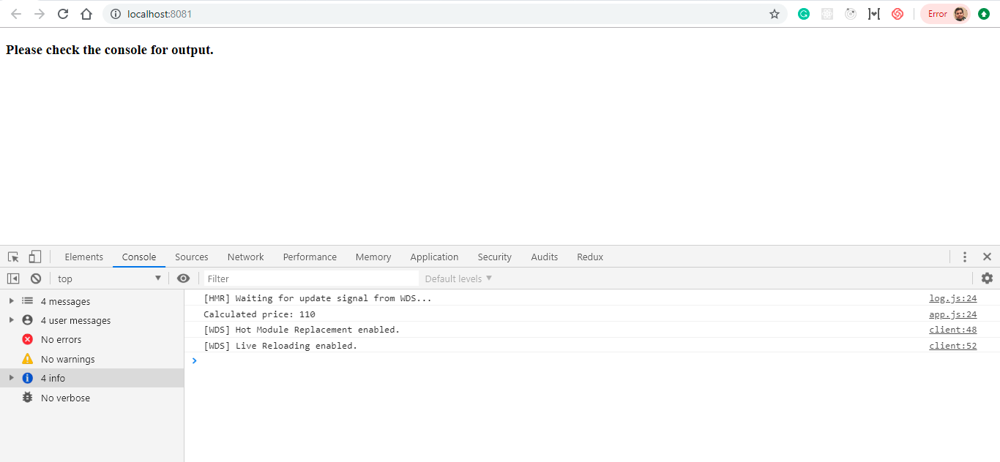
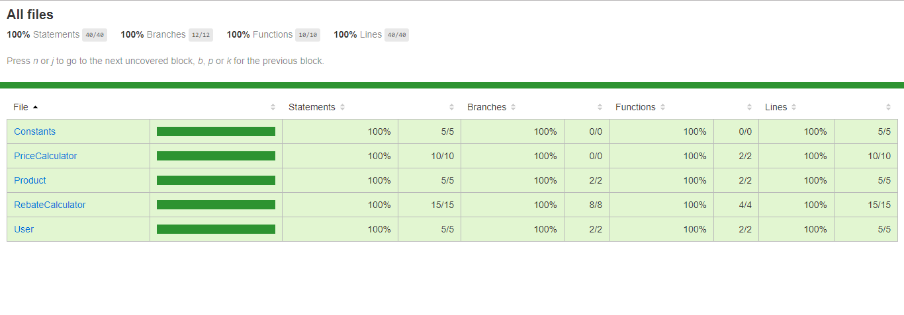

# PRODUCT PRICE CALCULATOR ASSIGMENT

This project is used to calcualte final price of product based on different scenarios

  - Product price
  - Product type
  - Product publish date
  - Customer type


#### Technologies used


* [Webpack 4](https://github.com/webpack/webpack) 
* [Babel 7](https://github.com/babel/babel) [ transforming JSX and ES6,ES7,ES8 ]
* [Jest](https://github.com/facebook/jest) [ Unit test]
* [Eslint](https://github.com/eslint/eslint/) with airbnb default config
* [Prettier](https://github.com/prettier/prettier) [ Code formatter ]
* [Webpack dev serve](https://github.com/webpack/webpack-dev-server) 

### Development

Install App dependencies:
```sh
$ npm install
```
- app will be started on specific port and opened in browser
Start App:
```sh
$ npm start
```
- coverage forlder will be created after running below command and coverage > lcov-report> index.html can be opened to see coverage in browser
Test cases and covergae:
```sh
$ npm test
```
Also 

#### Building for source
- build folder will be created after otimisation of code 
For production release:
```sh
$ npm run build
```

### Futher points

- current code is created keeping in mind the possible hypothetical scenarios
- code is designed for futher modification as application scope grows
- CSS is not kept in mind for bundling and optimisation 

### Screenshots





License
----

MIT
